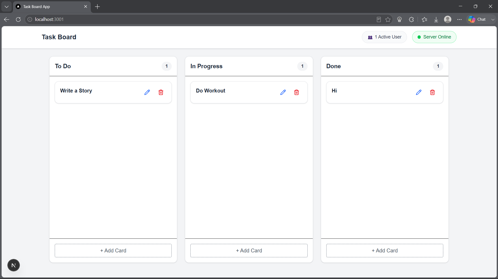
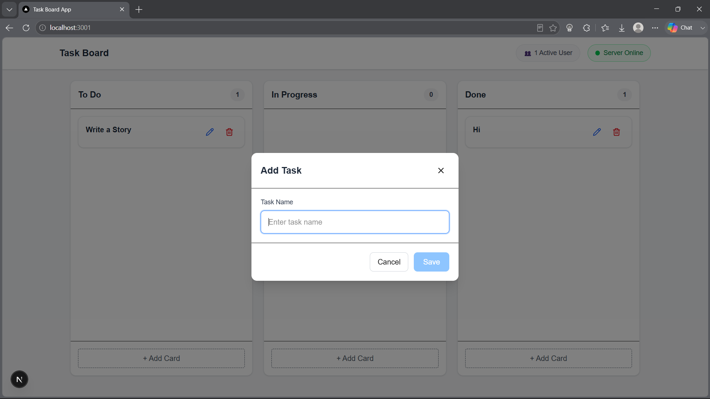
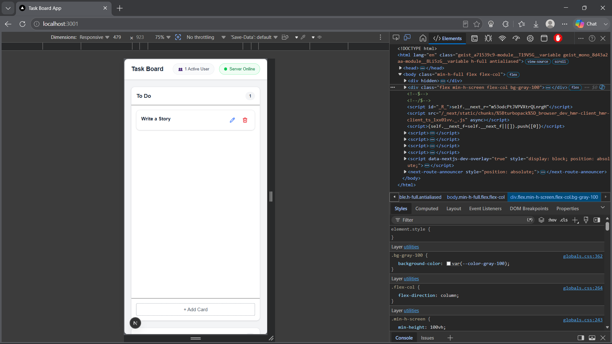

# Task Board Frontend

A modern and responsive Task Board application built with **Next.js**, **React**, **TypeScript**, **Tailwind CSS**, and **Socket.IO**. This application provides real-time task management with live updates across multiple connected clients.

---

## 🚀 Features

- 📋 View tasks grouped by status
  - To Do
  - In Progress
  - Done
- ➕ Create new tasks
- ✏️ Edit existing tasks
- 🗑️ Delete tasks
- 🔄 Real-time synchronization using Socket.IO
- 👥 Live active user count
- 🟢 Live server connection status
- 📱 Fully responsive design
- 🎨 Clean and modern UI

---

## 📸 Screenshots

### Home Page



### Create Task



### Mobile View



---

## 🛠️ Tech Stack

- Next.js
- React
- TypeScript
- Tailwind CSS
- Socket.IO Client
- Axios

---

## 📁 Project Structure

```
src/
│
├── app/
│   ├── layout.tsx
│   ├── page.tsx
│   └── globals.css
│
├── components/
│   ├── Board/
│   │   ├── Board.tsx
│   │   ├── Column.tsx
│   │   └── TaskCard.tsx
│   │
│   ├── Modal/
│   │   └── CardModal.tsx
│   │
│   └── Navbar.tsx
│
├── hooks/
│   └── useSocket.ts
│
├── libs/
│   └── socket.ts
│
├── services/
│   └── taskServices.ts
│
└── types/
    └── card.ts
```

---

## ⚙️ Installation

Clone the repository

```bash
git clone <repository-url>
```

Navigate into the project

```bash
cd task-board-frontend
```

Install dependencies

```bash
npm install
```

---

## 🔧 Environment Variables

Create a `.env.local` file in the project root.

```env
NEXT_PUBLIC_API_URL=http://localhost:3000
NEXT_PUBLIC_SOCKET_URL=http://localhost:3000
```

Adjust the URLs if your backend is running on a different host or port.

---

## ▶️ Run the Application

Development mode

```bash
npm run dev
```

Production

```bash
npm run build
npm start
```

The application will be available at

```
http://localhost:3001
```

---

## 🔌 Backend Requirement

This frontend requires the Task Board Backend server to be running.

Backend should expose:

- REST APIs
- Socket.IO server

Default Backend URL

```
http://localhost:3000
```

---

## 📡 Real-Time Events

The application listens for the following Socket.IO events:

| Event | Description |
|--------|-------------|
| task:created | Adds a newly created task |
| task:updated | Updates an existing task |
| task:deleted | Removes a deleted task |
| active-users | Updates connected user count |

---

## 📱 Responsive Design

The application is responsive across:

- Desktop
- Tablet
- Mobile

---

## ✨ Future Improvements

- Drag and Drop (dnd-kit)
- Task Search
- Filters
- Authentication
- User-specific Boards
- Dark Mode
- Toast Notifications
- Optimistic UI Updates

---

## 👨‍💻 Author

**Tilesh Kathiresan**
